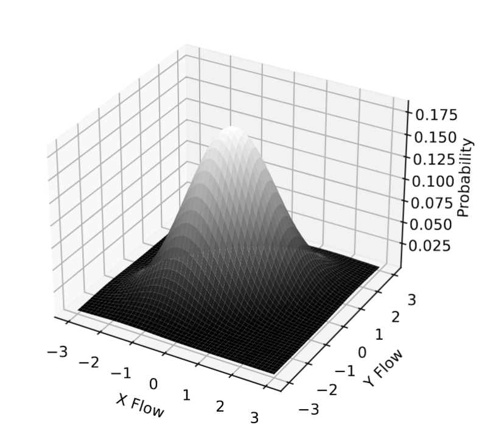

# CS4240 Deep learning: Paper Reproduction Project

This blog post describes our attempt to reproduce the results of this [paper](https://github.com/Sebastiaanvm/DL_Group35/blob/main/paper/1801.02612v2.pdf) of Spatially Transformed Adversarial Examples.
The following students of group 35 are part of this project:

| Name                      | ID      | Contact                              |
| ------------------------- | ------- | ------------------------------------ |
| Kai Grotepass             | 5953553 | k.grotepass@student.tudelft.nl       |
| Sebastiaan van Moergestel | 5421497 | s.a.vanmoergestel@student.tudelft.nl |

Our contribution can be seen in [`project.ipynb`](https://github.com/Sebastiaanvm/DL_Group35/blob/main/project.ipynb) where we attempt to recreate the deep learning models and adversarial attacks that are described in the paper.

# Introduction

According to the paper, Deep Neural Networks (DNN) are vulnerable to adversarial examples. Many algorithms can generate adversarial examples. The paper focuses on using spatial transformation for their adversarial examples as opposed to manipulating the pixel values directly in previous research. The paper claims using this method will bypass the current defence methods and therefore be a new potential for adversarial example generations and new corresponding defense designs. For the experiments, The paper uses three Deep-learning models and trains them on the MNIST dataset. The spatial transformed adversarial example attack is then performed. The success rate is then measured. The paper claims that the attack can achieve a nearly 100% success rate. Another claim is that by using this spatial transformation, the attacked MNIST data will be indistinguishable from non-attacked data.

For this reproduction project, we try to achieve the same results to see if the claims of the paper are justified.

# Reproduction

## Implementation

The design of the models utilized in our experiments is described in the paper and can be easily replicated. While Model A could be replicated as outlined in the paper, we found that the inclusion of max-pooling was necessary for Models B and C to achieve optimal efficiency.
For the training process, we used the popular MNIST dataset from the PyTorch libaray as well. Notably, the paper lacked certain critical parameters, including batch size, loss function, and learning rate. Different parameter values were explored to identify the most suitable configurations. To maintain consistency and facilitate reproducibility, we trained our models using default PyTorch settings, for example, a batch size of 64 and a learning rate of 0.001. The specific values utilized for our experiments and subsequent results can be seen in the [`code`](https://github.com/Sebastiaanvm/DL_Group35/blob/main/project.ipynb) itself.

Following the training phase on the MNIST dataset, we had to implement the spatially transformed adversarial examples. While the paper describes the algorithm, it did not provide accompanying code. Consequently, a decision was made to see if existing code was available online. A few other GitHub users had already implemented the spatially transformed adversarial examples attack. The selected code, which aligned with our own, can be seen [&#39;here&#39;](https://github.com/as791/stAdv-PyTorch/blob/main/StAdv_attack.ipynb).

## Optimisation

The first attempts to attack the trained models performed very poorly, with attack success rates that were below 10%, a far cry from the 99+% attack success rate  reported in [CITE]. The suspiscion was that this was largely due to some difference in the implimentation of the attack method, optomization configuration. As such we investigated a number of ways to improve the overall attack success rates of this technique, including configuration of the optomization, attack innitialization and various parameter tunings, such as loss function weights and confidence thresholds.

#### Loss Function Checking

The first step was of course to ensure that the loss funtion and optomization was implimented according to the work by [CITE]. There were a number of small mathematical errors that were identified and corrected such as a missing square root in the flow loss computation, however by and large the approach was consistant with [CITE]. The shift computation and flow loss are both comparitively simple mathematically speaking, and as such their methods could be tested and the outcomes corroborated with unit tests and inspection of the results. Unfortuantely the adversarial loss is somewhat more complex and makes use of pytorch models themselves, and as such there is no realistically feasible way to grasp and corroborate wheather the algorithm implimentation is behaving exactly as intended by [CITE].

#### Optomizer Variables

The next step to investigate the problem was looking at the optomizer setup itself. The optomizer we used was fmin_l_bfgs_b [CITE], which is the same optomizer used in [CITE]. However, [CITE] has no details regarding the specific configuration of the optomizer itself. As such we chose to investigate the optomizer configureation, primarily the convergence criteria. An example of this is the *pgtol* parameter (the projected gradient tolerance, which serves to stop the optomizer when the computed gradient is below a certain threshold). Values ranging from 1e-7 to 1e-10 were tested, as we suspected that the poor performance may be caused by the system stopping in local low gradient or valley regions, and thus causing the optomization to get stuck in poor solutions. However, neither these changes to *pgtol* nor to the other parameters introduced any descernable differences in the overall attack performance, therefore the optomization settings were set back to the default state.

#### Innitialization of Flow Matrix

The next step is the setup of the flow matrix itself which quantifies exactly how much each pixel is expected to shift. Again, no expliocit note on the innitialization of the flow matrix was found in [CITE], and as such the first version simply started with a matrix of zeros. This however means that the flow loss starts at 0 (which implicitely means that the innitial point is in some sort of local minimum, even if only in a pratial number of sub dimensions, and for the model to make any type of progress the adversarial loss needs to overcome the gradient of the flow loss in this local minima). Thus the flow matrix was innitialized with random values generated from a unit variance zero mean Gaussian distribution as seen here:

In this way the flow matrecies are outside of the potential local minima at the all zero point, but are not very far removed from the true image, since pixels will generally not be pushed to flow more than 1 pixel away, and the flow loss componant of the loss function will naturally push pixels back to their original positions, since the gaussian values are randomly generated, unless these point shifts are very beneficial to the adversarial attack. This made significant improvements to the overall attack success rate, boosting it by over 20%, a nearly 5 fold increase. This choice did however deteriorate the perceptual recognition of the attacks to some degree, as now the attack images, with different innitializations, diverged more from the original images, this phenomenon becomes even more prevelant at a later stage.

#### Confidence

Finally after ensuring that the mathematics and implimentation were in accordance with [CITE], and investigating the other parameters that could possibly have an impact on the results but were not discussed in [CITE] the results were still only in the range of 20-30% attack success rate. As such the only remaining step was to investigate the parameters which were indeed specified directly in [CITE]. Namely the confidence *κ* and and the flow loss weighting *τ*. [CITE] reported values of κ=0 and τ=0.05 respectively.

This investigation starts with κ, also known as the confidence. This parameter effectively quantifies the cutoff after which the the gradient of the adversarial loss becomes constant, and no longer contributes. Thus by increasing this cutoff the adversarial loss continues to contribute and push the attack flows towards a solution which is more likely to be succesful, beyond just the point where the logits of the true and untrue classes are equal, as is the case when κ=0. This improved the results further, and a value of 0.5 was chosen, as values larger than this had little effect. This is of course reasonable, since beyond a certain point, the optomizer will find optimal points where the loss functions balance out, and the confidence threshold no longer has as much of an effect, since the threshold simply isn't reached.

#### Loss Function Weighting

The last step on this path of parameter optomization was τ, which weights the overall flow loss relative to the adversarial loss. When talking about this parameter it is most intuative to view the flow loss as a form of penalization, which punishes points moving far away from their original positions or in different directions to their neighbours. This penalization means that the images retain their general structure, and edges are largely preserved, meaning that results are largely still similar to the original to a human eye and do not have strange artifacting as some other adversarial techniques produce. This however also constrains how much the attacks can change the original image, potentially limiting the algorithms attack ability. Thus various values of τ ranging from the innital 0.05 to 0 were tested. This unsurprisingly had a beneficial effect, pushing the attack success rate up by another 10-20% with sufficiently small values. The final results show the results with a rather small value of 0.0001. This of course is not ideal, as the attacks are no longer penalized for larger divergences from the original sample, and thus tend to look more noticably adversarial, a problem which is further exacerbated by the non-zero innitialization of the flow matrecies.

## Results

TODO show results

## Discussion

TODO how to improve more etc.

## References

* R. H. Byrd, P. Lu and J. Nocedal. A Limited Memory Algorithm for Bound Constrained Optimization, (1995), SIAM Journal on Scientific and Statistical Computing, 16, 5, pp. 1190-1208.
