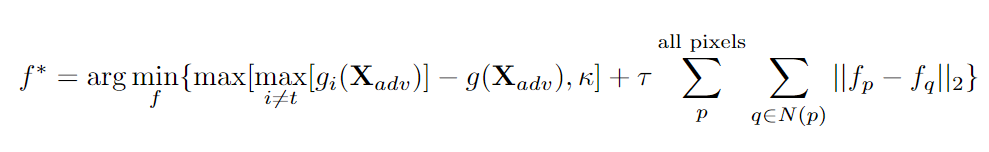
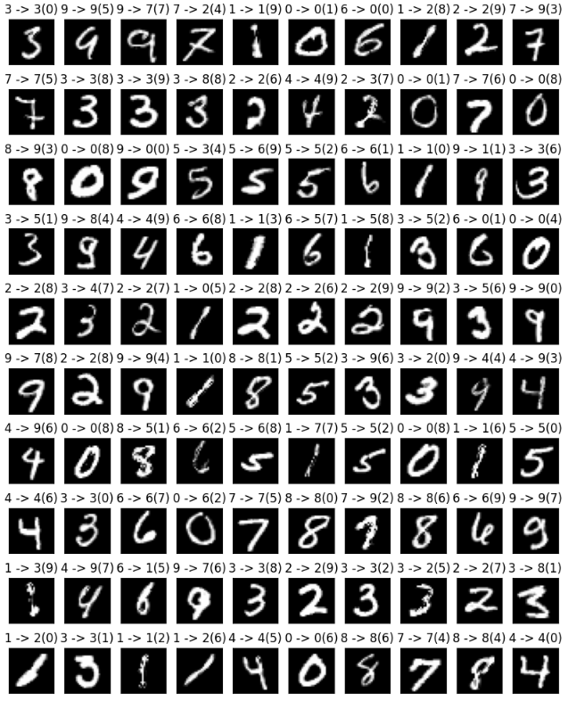
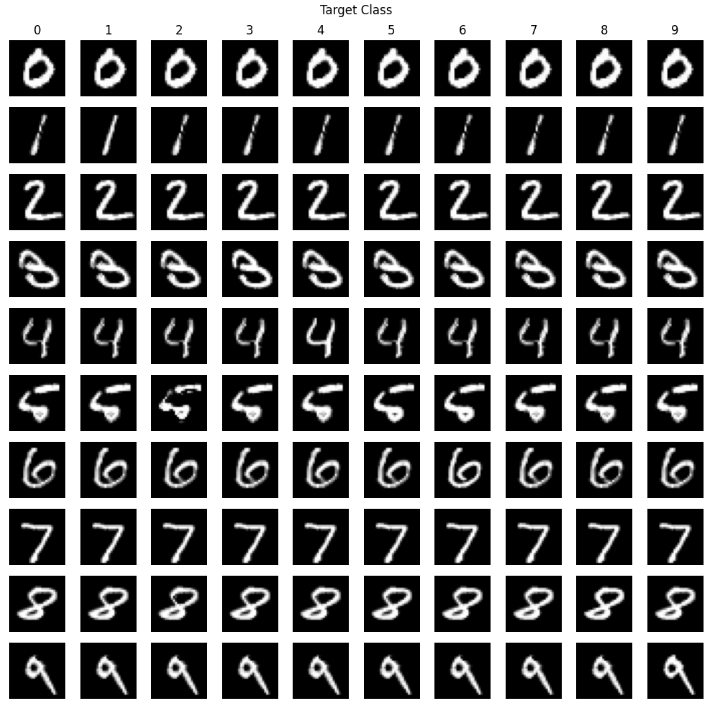
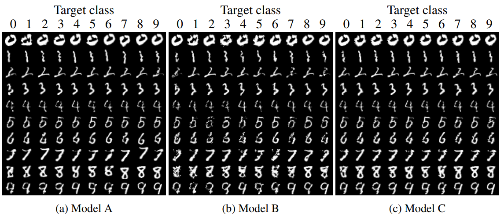
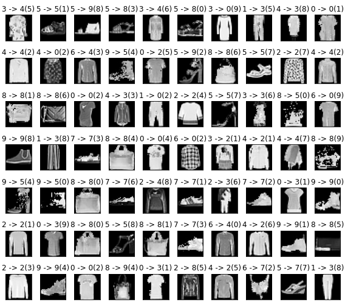

# CS4240 Deep learning: Paper Reproduction Project

This blog post describes our attempt to reproduce the results of this [paper](https://github.com/Sebastiaanvm/DL_Group35/blob/main/paper/1801.02612v2.pdf) of Spatially Transformed Adversarial Examples.
The following students of group 35 are part of this project:

| Name                      | ID      | Contact                              |
| ------------------------- | ------- | ------------------------------------ |
| Kai Grotepass             | 5953553 | k.grotepass@student.tudelft.nl       |
| Sebastiaan van Moergestel | 5421497 | s.a.vanmoergestel@student.tudelft.nl |

Our contribution can be seen in [`project.ipynb`](https://github.com/Sebastiaanvm/DL_Group35/blob/main/project.ipynb) where we attempt to recreate the deep learning models and adversarial attacks that are described in the paper.

# Introduction

According to the paper, Deep Neural Networks (DNN) are vulnerable to adversarial examples. While various algorithms have been developed to generate these adversarial inputs, this paper takes a unique approach by focusing on spatial transformations rather than direct manipulation of pixel values, as seen in prior research. The paper claims using this method will bypass the current defence methods and therefore be a new potential for adversarial example generations and new corresponding defense designs. For the experiments, The paper uses three Deep-learning models and trains them on the MNIST dataset. The spatial transformed adversarial example attack is then performed. The success rate is then measured. The paper claims that the attack can achieve a nearly 100% success rate. Another claim is that by using this spatial transformation, the attacked MNIST data will be indistinguishable from non-attacked data.

For this reproduction project, we try to achieve the same results to see if the claims of the paper are justified.

# Reproduction

## Implementation

The design of the models utilized in our experiments is described in the paper and can be easily replicated. We refer these models as Model A, Model B and Model C. While Model A could be replicated as outlined in the paper, we found that the inclusion of max-pooling was necessary for Models B and C to achieve optimal efficiency.
For the training process, we used the popular MNIST dataset from the PyTorch libaray as well. Notably, the paper lacked certain critical parameters, including batch size, loss function, and learning rate. Different parameter values were explored to identify the most suitable configurations. To maintain consistency and facilitate reproducibility, we trained our models using default PyTorch settings, for example, a batch size of 64 and a learning rate of 0.001. The amount of epochs were set to 20 as this seems to be the optimal balance between training accuracy and speed efficiency. All specific values utilized for our experiments and subsequent results can be seen in the [`code`](https://github.com/Sebastiaanvm/DL_Group35/blob/main/project.ipynb) itself.

Following the training phase on the MNIST dataset, we had to implement the spatially transformed adversarial examples. While the paper describes the algorithm, it did not provide accompanying code. Consequently, a decision was made to see if existing code was available online. A few other GitHub users had already implemented the spatially transformed adversarial examples attack. The selected code, which aligned with our own, can be seen [&#39;here&#39;](https://github.com/as791/stAdv-PyTorch/blob/main/StAdv_attack.ipynb).

The basic approach of this adversarieal algorithm is to generate a flow field by minimizing a loss function which has two componants, an adversarial and a flow loss. This flow field is then used to alter the original input image by computing the value at each pixel of the adversarial image by its original value shifted by the flow field and computed from the original image using the bilinear transform [CITE].

The flow field is calulated as:

Where g(x) is the logit output of model g, and i the specific ith logit element. N(p) is the four neighbouring pixels of the point p. The first term is known as the adversarial loss, as it quantifies how effective the adversarial attack is, while the second term is the flow loss. κ is the cofidence parameter, and τ is the relative weight of the flow loss.

## Optimisation

The first attempts to attack the trained models performed very poorly, with attack success rates that were below 10%, a far cry from the 99+% attack success rate  reported in [CITE]. The suspicion was that this was largely due to some difference in the implementation of the attack method, optimization configuration. As such we investigated a number of ways to improve the overall attack success rates of this technique, including configuration of the optimization, attack initialization and various parameter tunings, such as loss function weights and confidence thresholds.

#### Loss Function Checking

The first step was of course to ensure that the loss function and optimization was implemented according to the work by [CITE]. There were a number of small mathematical errors that were identified and corrected such as a missing square root in the flow loss computation, however by and large the approach was consistent with [CITE]. The shift computation and flow loss are both comparatively simple mathematically speaking, and as such their methods could be tested and the outcomes corroborated with unit tests and inspection of the results. Unfortunately the adversarial loss is somewhat more complex and makes use of pytorch models themselves, and as such there is no realistically feasible way to grasp and corroborate whether the algorithm implementation is behaving exactly as intended by [CITE].

#### Optimizer Variables

The next step to investigate the problem was looking at the optimizer setup itself. The optimizer we used was fmin_l_bfgs_b [CITE], which is the same optimizer used in [CITE]. However, [CITE] has no details regarding the specific configuration of the optimizer itself. As such we chose to investigate the optimizer configuration, primarily the convergence criteria. An example of this is the *pgtol* parameter (the projected gradient tolerance, which serves to stop the optimizer when the computed gradient is below a certain threshold). Values ranging from 1e-7 to 1e-10 were tested, as we suspected that the poor performance may be caused by the system stopping in local low gradient or valley regions, and thus causing the optimization to get stuck in poor solutions. However, neither these changes to *pgtol* nor to the other parameters introduced any discernible differences in the overall attack performance, therefore the optimization settings were set back to the default state.

#### Initialization of Flow Matrix

The next step is the setup of the flow matrix itself which quantifies exactly how much each pixel is expected to shift. Again, no explicit note on the initialization of the flow matrix was found in [CITE], and as such the first version simply started with a matrix of zeros. This however means that the flow loss starts at 0 (which implicitly means that the initial point is in some sort of local minimum, even if only in a partial number of sub dimensions, and for the model to make any type of progress the adversarial loss needs to overcome the gradient of the flow loss in this local minima). Thus the flow matrix was initialised with random values generated from a unit variance zero mean Gaussian distribution as seen here:

In this way the flow matrices are outside of the potential local minima at the all zero point, but are not very far removed from the true image, since pixels will generally not be pushed to flow more than 1 pixel away, and the flow loss component of the loss function will naturally push pixels back to their original positions, since the gaussian values are randomly generated, unless these point shifts are very beneficial to the adversarial attack. This made significant improvements to the overall attack success rate, boosting it by over 20%, a nearly 5 fold increase. This choice did however deteriorate the perceptual recognition of the attacks to some degree, as now the attack images, with different initializations, diverged more from the original images, this phenomenon becomes even more prevalent at a later stage.

#### Confidence

Finally after ensuring that the mathematics and implementation were in accordance with [CITE], and investigating the other parameters that could possibly have an impact on the results but were not discussed in [CITE] the results were still only in the range of 20-30% attack success rate. As such the only remaining step was to investigate the parameters which were indeed specified directly in [CITE]. Namely the confidence *κ* and and the flow loss weighting *τ*. [CITE] reported values of κ=0 and τ=0.05 respectively.

This investigation starts with κ, also known as the confidence. This parameter effectively quantifies the cutoff after which the gradient of the adversarial loss becomes constant, and no longer contributes. Thus by increasing this cutoff the adversarial loss continues to contribute and push the attack flows towards a solution which is more likely to be successful, beyond just the point where the logits of the true and untrue classes are equal, as is the case when κ=0. This improved the results further, and a value of 0.5 was chosen, as values larger than this had little effect. This is of course reasonable, since beyond a certain point, the optimizer will find optimal points where the loss functions balance out, and the confidence threshold no longer has as much of an effect, since the threshold simply isn't reached.

#### Loss Function Weighting

The last step on this path of parameter optimization was τ, which weights the overall flow loss relative to the adversarial loss. When talking about this parameter it is most intuitive to view the flow loss as a form of penalization, which punishes points moving far away from their original positions or in different directions to their neighbours. This penalization means that the images retain their general structure, and edges are largely preserved, meaning that results are largely still similar to the original to a human eye and do not have strange artifacting as some other adversarial techniques produce. This however also constrains how much the attacks can change the original image, potentially limiting the algorithm's attack ability. Thus various values of τ ranging from the initial 0.05 to 0 were tested. This unsurprisingly had a beneficial effect, pushing the attack success rate up by another 10-20% with sufficiently small values. The final results show the results with a rather small value of 0.0001. This of course is not ideal, as the attacks are no longer penalised for larger divergences from the original sample, and thus tend to look more noticeably adversarial, a problem which is further exacerbated by the non-zero initialization of the flow matrices.

## Results

This section contains the final results after the optimalisation on the attack. The code used for these results can also be seen back in the [`code`](https://github.com/Sebastiaanvm/DL_Group35/blob/main/project.ipynb).
As stated before, our objective is to get a replication of the results described in the paper. To achieve this, we recreated the exact experimental scenarios outlined within the paper. Consequently, we applied the attack methodology to the MNIST dataset, aiming to provoke misclassifications within the targeted data points.

In the the following figure, we provide a visual representation of select attacks, illustrating the true class, the misclassified class, and the targeted class for each attack. These samples offer a glimpse into the effectiveness and impact of the applied attack strategy.

The next figure showcases our replicated results, aligning closely to the results described in the referenced paper. Here, we present the classes that have been successfully attacked and subsequently misclassified.

We compare this with the same figure of the paper, which can be seen below:

While our results bear similarities to the paper's findings, slight diviations can be seen due to different values of paramters that were not explicitly detailed in the original paper. Despite these nuanced differences, our replicated results maintain a consistent pattern and similarities, reinforcing the validity of our attack implementation.

Following the training and attack phases on our three models, we evaluated the accuracy and attack success rate as detailed in the following tables. The first table contains the results of the original paper. The second details our own results evaluated from our experiments. A direct comparison reveals that our results exhibit lower values for both accuracy and attack success rate. The original paper lacks critical information on the parameters used in both training the models and executing the attacks. This limitation restricts our ability to optimize our models effectively.

| Model               | A      | B      | C       |
| ------------------- | ------ | ------ | ------- |
| Accuracy (p)        | 98.58% | 98.94% | 99.11%  |
| Attack success rate | 99.95% | 99.98% | 100.00% |

| Model               | A      | B      | C      |
| ------------------- | ------ | ------ | ------ |
| Accuracy (p)        | 93.95% | 83.04% | 91.11% |
| Attack success rate | 41.00% | 50.50% | 53.50% |

To further reinforce our findings, conducted additional experiments using the same settings employed in our previous experiments. However, this time, we transitioned from the simple MNIST dataset to the more complicated FashionMNIST dataset. The attack results are depicted in the following figure:

The new results across the three models are summarized in the table below:

| Model               | A      | B      | C      |
| ------------------- | ------ | ------ | ------ |
| Accuracy (p)        | 72.40% | 69.34% | 71.42% |
| Attack success rate | 52.00% | 55.00% | 60.00% |

A decrease in accuracy and an increase in attack success rate is observed. This shift can be explained by the lower training accuracy, which makes it easier to misscalssify target data points with our attack.

## Discussion

From the quantitative results in the previous section we can see that after all the optimization the model achieves an attack success rate of 40-55% depending on the model being attacked. This is far superior to the results obtained at the start, but still not close to the results reported in the original paper, which was over 99%. This is assumed to be caused by some incorrect parameter/structural setup, as a large number of details relating to the models and adversarial optimization are not included in [CITE] itself.

Due to the parameter adjustments made in the previous section we can see that the overall image clarity and identifiability has deteriorated drastically, which is unfortunately very much counter to the original intention of the authors of [CITE]. This may be more easily discernible by a human due to the simplicity of the MNIST dataset, and on a more complex image may be indiscernible.

There are two other possible explanations we considered for the poor results obtained by this algorithm aside from parameter setup. Firstly, it is possible that the gradient of the adversarial loss component of the overall loss used to calculate the optimal flow does not correctly calculate the gradients from the model itself, this is an implementation issue, and is very challenging to identify without existing code to compare against. The second possibility is that the models tested in [CITE] were trained differently. A possibility in this line is that since the models in question were trained far more in [CITE] than those tested by us, and as such could be more sensitive to small perturbations than the models which have been trained less.

There is another interesting note to make from the results above: we can see from the target classes (shown in brackets) that even when the attack is successful, it often does not classify the attack to the desired class, simply to some incorrect class. This may support the idea that the adversarial loss gradients are not being correctly computed, and simply introducing enough of a disturbance to cause misclassification.

The most natural extension to this program would be to isolate the difference between this implementation and the original implementation by the authors. Furthermore, this technique could be tested on a number of different additional datasets and models to identify its performance. Variations to this technique such as different optimisers and optimisation parameters could give additional insights. Finally, in terms of defence techniques, an effective tool noted in [CITE] was a gaussian blur to remove the alterations of the adversarial flow. Another avenue of defence may be other digital filters such as opening and closing, or more complex filter structures if it is known in which frequency region the images of interest exist in the 2d Gaussian domain.

## References

* R. H. Byrd, P. Lu and J. Nocedal. A Limited Memory Algorithm for Bound Constrained Optimization, (1995), SIAM Journal on Scientific and Statistical Computing, 16, 5, pp. 1190-1208.
